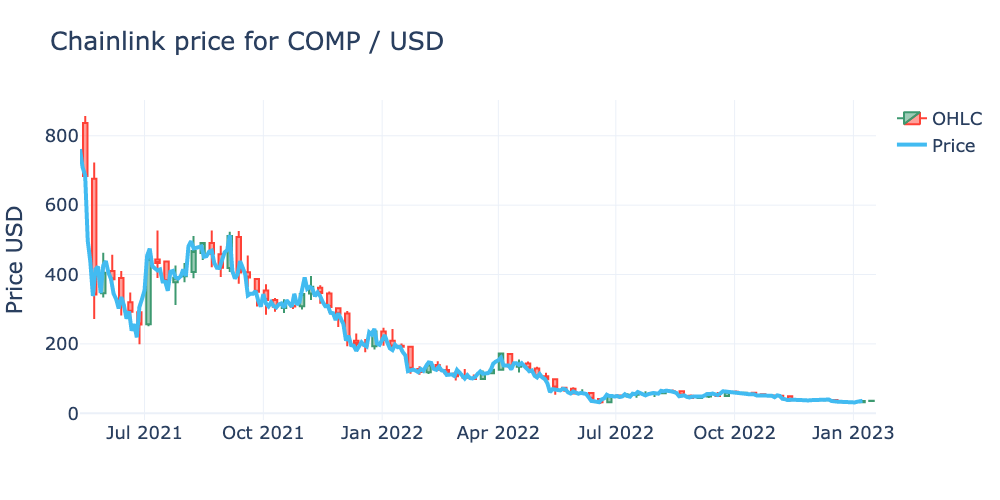

# Chainlink Data Feed Crawler

This code shows how to gather prices from the [Chainlink Data Feed](https://data.chain.link).

## What's New

----------

- COMP / USD support

The Jupyter notebook code is available [here](./chainlink-data-feed.ipynb).

## Ask a Question

---

- For reporting bugs please use the [chainlink-data-feed-crawler/issues](https://github.com/johnnatan-messias/chainlink-data-feed-crawler/issues) page.

In case of any issue, please feel free to contact me at johnme@mpi-sws.org

## License

MIT
